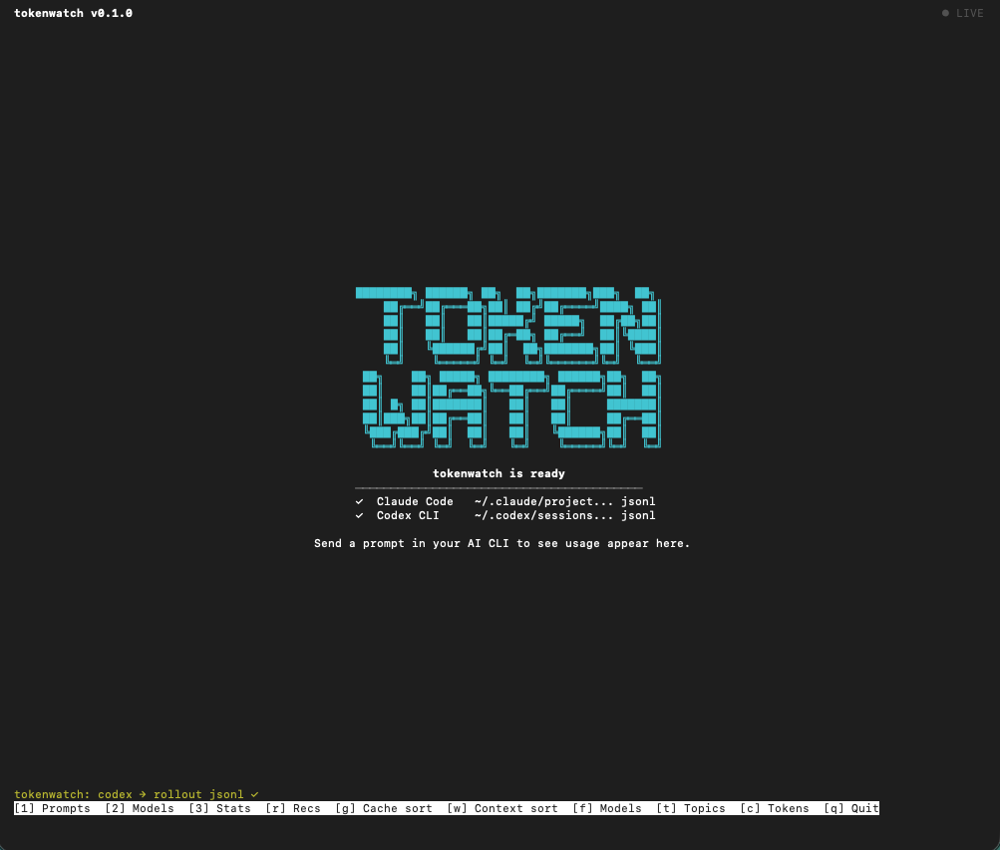

[License: MIT](LICENSE) · [Node.js ≥18](package.json) · [TypeScript](https://www.typescriptlang.org/) · [Local-first](#data-and-privacy)

<p align="center">
  
</p>

`tokenwatch` is a local-first TypeScript terminal companion for coding agent sessions. It detects supported local session storage, renders a live Ink dashboard, tracks budgets, and exports Markdown, CSV, or JSON reports without calling a network pricing API.

## Supported Sources


| Source      | Local data used                                                                                                | Prompt visibility                                      | Status    |
| ----------- | -------------------------------------------------------------------------------------------------------------- | ------------------------------------------------------ | --------- |
| Claude Code | JSONL session logs under `~/.claude` or `$CLAUDE_HOME`                                                         | Prompt text plus assistant usage when both log entries exist | Supported |
| Codex CLI   | `state_5.sqlite`, `logs_2.sqlite`, rollout JSONL sessions, and log fallbacks under `~/.codex` or `$CODEX_HOME` | Rollout JSONL has prompt text; SQLite prompt text is best-effort | Supported |


tokenwatch reads local files only. It does not mutate Claude Code or Codex CLI storage.

## Visibility Model

tokenwatch reports the most precise local data each supported source exposes:

- Claude Code JSONL: user prompt text is paired with the next assistant usage entry.
- Codex rollout JSONL: `user_message` or user `response_item` entries are paired with `token_count` usage.
- Codex `state_5.sqlite`: points tokenwatch to the active rollout JSONL and can add model and goal metadata.
- Codex `logs_2.sqlite`: `response.completed` usage is always counted; prompt text is attached only when a preceding user-message telemetry row is present.

When local storage does not expose prompt text for a turn, tokenwatch still counts tokens, cost, cache, model, and totals, and reports the prompt as unavailable instead of guessing.

## Installation

### Quick Start

```sh
npm install -g tokenwatch
tokenwatch
```

### From Source

```sh
git clone https://github.com/Kk120306/tokenwatch.git
cd tokenwatch
npm install
npm run build
npm install -g .
tokenwatch
```

Runtime: Node.js 18 or newer.

## Usage

```sh
# Start the live dashboard
tokenwatch

# Watch custom storage locations
tokenwatch --claude-glob "$HOME/.claude/projects/**/*.jsonl"
tokenwatch --codex-db "$HOME/.codex/logs_2.sqlite"

# List and select detected sessions
tokenwatch sessions
tokenwatch --session "$HOME/.codex/sessions/2026/05/18/rollout.jsonl" --session-source codex

# Tag every prompt in the current run
tokenwatch --topic documentation

# Hide prompt text in the dashboard or generated reports
tokenwatch --redact-prompts
tokenwatch export --json --redact-prompts

# Track local daily and weekly budgets
tokenwatch --daily-budget 5 --weekly-budget 25 --alert-at 0.8
tokenwatch --reset-budget

# Export the most recent detected session
tokenwatch export
tokenwatch export --md --out ./reports
tokenwatch export --csv
```

## Dashboard Controls


| Key         | Action                           |
| ----------- | -------------------------------- |
| `1`         | Prompts view                     |
| `2`         | Models view                      |
| `3`         | Stats view                       |
| `r`         | Recommendation stats             |
| `g`         | Toggle cache-grade sorting       |
| `w`         | Toggle context-usage sorting     |
| `f`         | Model filter                     |
| `t`         | Topic filter                     |
| `c`         | Toggle cost and token detail     |
| Up and Down | Move selection                   |
| Enter       | Expand a prompt or apply filters |
| Escape      | Close filter overlay             |
| Space       | Toggle a filter option           |
| `q`         | Quit                             |


## Features

- Live Dashboard: Render prompt, model, and stats views in an interactive terminal UI.
- Multi-Source Detection: Detect Claude Code JSONL and Codex CLI SQLite, JSONL, and log storage.
- Cost Tracking: Estimate cost from bundled `pricing.json` data with safe zero-cost fallback for unknown models.
- Cache Visibility: Show cached input tokens, cache hit rates, cache grades, and estimated cache savings.
- Context Pressure: Estimate context-window usage for known models.
- Budget Tracking: Persist daily and weekly spend under `~/.tokenwatch`.
- Topic Grouping: Auto-classify prompt topics, add local keyword rules, or force a manual topic with `--topic`.
- Prompt Privacy: Replace captured prompt text with `[redacted]` in the dashboard and reports.
- Model Recommendations: Compare observed model costs by topic after enough prompts are available.
- Goal Metadata: Show Codex goal information when present in local Codex state.
- Report Export: Generate Markdown, CSV, and JSON reports for detected or explicit sessions.
- Local-First Operation: No network calls, no remote pricing lookup, and no mutation of AI CLI state.

## CLI Reference

```sh
tokenwatch [options]
tokenwatch sessions
tokenwatch pricing
tokenwatch export [export-options]
```

### Options


| Option                     | Description                                                                              |
| -------------------------- | ---------------------------------------------------------------------------------------- |
| `sessions`                 | List detected local Claude Code and Codex CLI session paths.                             |
| `pricing`                  | Show bundled pricing freshness, source URLs, and model rates.                            |
| `--session <path>`         | Watch a specific JSONL, log, or SQLite session path.                                     |
| `--session-source <source>`| Source for ambiguous `--session` JSONL paths: `claude` or `codex`.                       |
| `--claude-glob <glob>`     | Claude Code JSONL glob. Defaults to auto-detection from `$CLAUDE_HOME` or `~/.claude`.   |
| `--codex-db <path>`        | Codex SQLite database path. Defaults to auto-detection from `$CODEX_HOME` or `~/.codex`. |
| `--topic <name>`           | Manually tag every parsed prompt in the session.                                         |
| `--redact-prompts`         | Replace captured prompt text with `[redacted]` in the TUI and exports.                   |
| `--daily-budget <amount>`  | Daily budget in USD. Overrides `~/.tokenwatch/config.json`.                              |
| `--weekly-budget <amount>` | Weekly budget in USD. Overrides `~/.tokenwatch/config.json`.                             |
| `--alert-at <pct>`         | Budget alert threshold from `0.0` to `1.0`. Default: `0.8`.                              |
| `--reset-budget`           | Reset persisted daily and weekly spend totals, then start watching.                      |
| `-h`, `--help`             | Show help.                                                                               |


### Export Options


| Option        | Description                                                       |
| ------------- | ----------------------------------------------------------------- |
| `export`                    | Write reports without launching the TUI. Defaults to Markdown and CSV.                  |
| `--md`                      | Include the Markdown report.                                                           |
| `--csv`                     | Include the CSV report.                                                                |
| `--json`                    | Include a structured JSON report with summary, group, prompt, cache, context, and goal fields. |
| `--redact-prompts`          | Replace captured prompt text with `[redacted]` in generated reports.                   |
| `--session <path>`          | Export a specific JSONL, log, or SQLite session instead of the newest detected session. |
| `--session-source <source>` | Source for ambiguous export session JSONL paths: `claude` or `codex`.                  |
| `--out <dir>`               | Write reports to this directory. Default: `./tokenwatch-exports`.                      |


## Configuration

Environment variables:


| Variable      | Description                                            |
| ------------- | ------------------------------------------------------ |
| `CODEX_HOME`  | Codex home directory checked before `~/.codex`.        |
| `CLAUDE_HOME` | Claude Code home directory checked before `~/.claude`. |


Optional configuration:

```json
{
  "dailyBudgetUsd": 5,
  "weeklyBudgetUsd": 25,
  "alertAt": 0.8,
  "redactPromptText": false,
  "topicRules": [
    {
      "topic": "billing",
      "keywords": ["stripe", "invoice", "refund"]
    },
    {
      "topic": "frontend",
      "keywords": ["react", "css", "layout"]
    }
  ]
}
```

Save that as `~/.tokenwatch/config.json`. Custom `topicRules` are checked before the built-in classifier. Set `redactPromptText` to `true` or pass `--redact-prompts` to keep prompt text out of tokenwatch's TUI state and generated reports. CLI budget flags override budget values for the current run, and `--topic <name>` overrides all automatic topic classification for that session.

## Reports

```sh
tokenwatch export
```

Export mode reads the most recent detected session and writes reports under `./tokenwatch-exports` by default.
Pass `--session <path>` to export a specific session from `tokenwatch sessions`, and add `--session-source` when the path is an ambiguous JSONL file.

Markdown reports include totals, model breakdowns, topic breakdowns, cache savings, prompt excerpts, and goal metadata when available.

CSV reports include prompt-level rows plus a session summary row for spreadsheet analysis.

JSON reports include the same prompt-level data in a stable `schemaVersion: 1` structure for scripts and dashboards.

## Pricing

Pricing is bundled in `pricing.json` and keyed by model name. Unknown models still render, but their estimated cost is `$0.0000` until pricing is added. Run `tokenwatch pricing` to see when the bundled rates were verified, the official source URLs, and whether the local table is older than the freshness window.

Bundled model keys include:

- `claude-opus-4-7`
- `claude-opus-4-6`
- `claude-sonnet-4-6`
- `claude-sonnet-4-5`
- `claude-haiku-4-5`
- `gpt-5.5`
- `gpt-5.4`
- `gpt-5.4-mini`
- `gpt-5.2`
- `gpt-5.1`
- `gpt-5`
- `gpt-5-mini`
- `gpt-5.2-codex`
- `gpt-5.1-codex`
- `codex-mini-latest`

## Data and Privacy

tokenwatch is local-first:

- Reads local Claude Code and Codex CLI data.
- Reads bundled local pricing data.
- Writes only tokenwatch budget state and optional export files.
- Does not send prompts, paths, token counts, or cost data over the network.
- Does not modify Claude Code or Codex CLI storage.
- Can replace prompt text with `[redacted]` in tokenwatch-rendered state and reports with `--redact-prompts` or `redactPromptText`.

Redaction does not edit source Claude Code or Codex CLI logs. Avoid committing private session logs, generated reports with prompt text, files from `~/.claude`, files from `~/.codex`, or files from `~/.tokenwatch`.

## Documentation

- [Architecture](docs/ARCHITECTURE.md)
- [Data storage notes](docs/DATA_STORAGE.md)
- [Test spec](docs/TEST_SPEC.md)
- [Product requirements](docs/PRD.md)

## Development Setup

```sh
npm install
npm run typecheck
npm test
```

Useful local commands:

```sh
npm run build
npm install -g .
tokenwatch
```

Tests use Node's built-in `node:test` runner and import compiled files from `dist/`, so `npm test` builds before running the suite.

## Contributing

Contributions are welcome under the MIT License. See [CONTRIBUTING.md](CONTRIBUTING.md) for setup, pull request expectations, and fixture guidance.

Good first areas:

- Add pricing entries for new models.
- Add sanitized fixtures for new Claude Code or Codex CLI log shapes.
- Improve report formatting.
- Improve docs for common terminal setups.
- Add tests around detection, parsing, budgets, and recommendations.

## Security

Do not open public issues with private prompts, local session logs, access tokens, API keys, or machine-specific paths. See [SECURITY.md](SECURITY.md) for the reporting policy.

## License

[MIT](LICENSE) © tokenwatch contributors.
